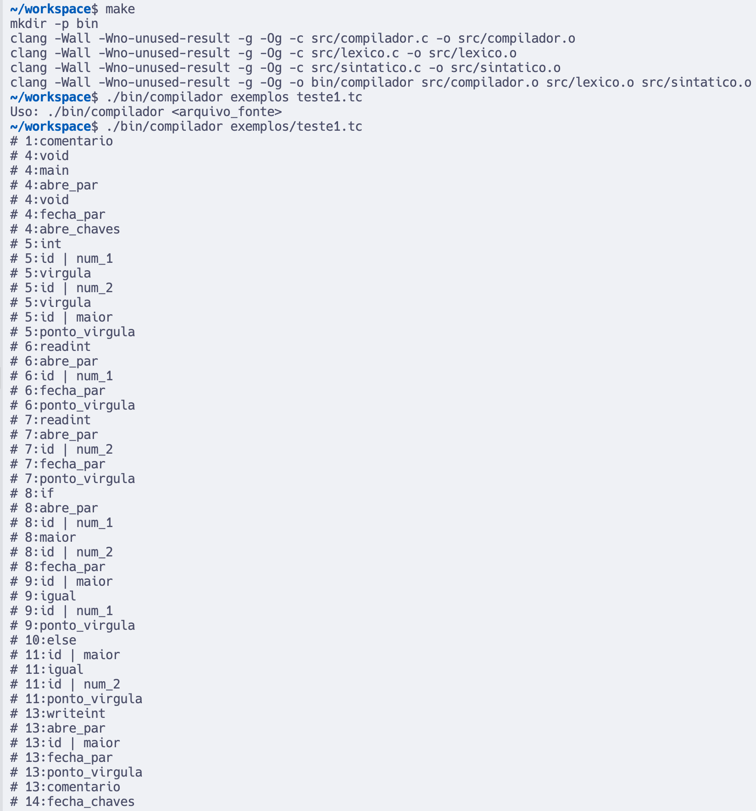

# Compilador TINY-C

Este documento explica o trabalho de desenvolvimento do compilador para a linguagem TINY-C, desenvolvido como projeto para a disciplina de Compiladores.

## Autores
- Marcello Gonzatto Birkan (10381938) & Daniela Brazolin Flauto (10395891)

## Partes Concluídas do Projeto

### Análise Léxica (100% concluída)
- Implementação completa do reconhecimento de todos os átomos da linguagem TINY-C
- Tratamento de tokens, incluindo palavras reservadas, identificadores, constantes, operadores e símbolos
- Reconhecimento de constantes inteiras em formato hexadecimal
- Tratamento de comentários (linha e bloco)
- Contagem de linhas e tracking da posição no código-fonte
- Detecção e relato de erros léxicos

### Análise Sintática (100% concluída)
- Implementação do analisador sintático por descida recursiva (Recursive Descent Parser)
- Suporte à gramática completa da linguagem TINY-C conforme especificada
- Análise de declarações de variáveis, comandos condicionais e de repetição
- Tratamento de expressões com níveis de precedência
- Detecção e relato detalhado de erros sintáticos

### Programa Principal (100% concluído)
- Interface para leitura do arquivo fonte
- Integração entre os analisadores léxico e sintático
- Relato de informações durante a análise
- Contagem e exibição do total de linhas analisadas

## Bugs e Limitações Conhecidas

1. **Tratamento de identificadores longos**: Identificadores com mais de 15 caracteres são rejeitados conforme especificação, porém pode haver casos em que a mensagem de erro não é suficientemente clara.

2. **Comentários de bloco não fechados**: O analisador léxico não reporta adequadamente comentários de bloco (`/* */`) que não são fechados antes do fim do arquivo.

3. **Constantes caractere com escape**: Não há suporte para caracteres de escape em constantes caractere (por exemplo, `'\n'`), apenas caracteres ASCII simples.

4. **Mensagens de erro**: Embora funcionais, algumas mensagens de erro poderiam ser mais descritivas para auxiliar o usuário a encontrar e corrigir problemas.

## Decisões de Design e Implementação

### Organização do Código
- **Uso de arquivos de cabeçalho**: Implementamos interfaces claras através de arquivos .h para cada módulo.

### Analisador Léxico
- **Tabela de palavras reservadas**: Utilizamos uma estrutura estática para armazenar as palavras reservadas, facilitando a verificação.
- **Buffer de lexema**: Implementamos um buffer para armazenar temporariamente os lexemas durante o reconhecimento, otimizando o processo.
- **Função de conversão para string**: Criamos a função `atomo_para_string` para facilitar a exibição de mensagens durante a análise.

### Analisador Sintático
- **Funções recursivas para não-terminais**: Cada símbolo não-terminal da gramática foi implementado como uma função separada, tornando a implementação mais clara e alinhada com a especificação da gramática.
- **Função consome()**: Centralizamos a verificação e consumo de átomos em uma única função, simplificando o tratamento de erros.
- **Variável lookahead**: Utilizamos uma variável global para armazenar o próximo átomo a ser analisado, implementando um mecanismo simples de lookahead.

### Tratamento de Erros
- **Mensagens**: Implementamos mensagens que mostram a linha, o átomo esperado e o encontrado, auxiliando na depuração.
- **Parada após erro**: Optamos por encerrar a análise após o primeiro erro, já que a recuperação de erro não era um requisito do projeto.

## Possíveis Melhorias Futuras
- Implementação de um mecanismo de recuperação de erros para permitir a detecção de múltiplos erros em uma única execução
- Melhorias nas mensagens de erro para torná-las mais informativas
- Suporte a caracteres de escape em constantes caractere
- Implementação das fases seguintes do compilador (análise semântica e geração de código)

## Uso

Para compilar o compilador TINY-C:

```bash
make
```

Para executar a análise em um arquivo TINY-C:

```bash
./bin/compilador <arquivo_fonte>
```

## Exemplo de Execução

Abaixo está uma imagem mostrando a execução do compilador em um dos arquivos de teste:



## Descrição do Projeto

O compilador TINY-C implementa as fases de análise léxica e sintática de um compilador para a linguagem TINY-C, uma simplificação da linguagem C. A linguagem TINY-C possui as seguintes características:

- Tipos inteiros (int) e caractere (char)
- Comandos condicionais (if)
- Comandos de repetição (while)
- Funções de entrada (readint) e saída (writeint)

O compilador realiza a análise léxica e sintática de programas escritos em TINY-C, reportando erros e apresentando informações sobre os átomos reconhecidos durante a análise.

## Estado Atual do Projeto

O compilador está completamente implementado com as seguintes funcionalidades:

- Análise léxica completa, com reconhecimento de todos os átomos da linguagem TINY-C
- Análise sintática completa, verificando a corretude dos programas de acordo com a gramática
- Geração de mensagens de erro detalhadas em caso de problemas léxicos ou sintáticos
- Contagem de linhas do arquivo fonte e apresentação do total de linhas analisadas

## Estrutura do Projeto

O projeto está organizado da seguinte forma:

- `src/`: Código-fonte do compilador
  - `compilador.c`: Programa principal que coordena a análise
  - `lexico.c` e `lexico.h`: Implementação do analisador léxico
  - `sintatico.c` e `sintatico.h`: Implementação do analisador sintático
- `exemplos/`: Exemplos de programas em TINY-C
  - `teste1.tc`: Exemplo que encontra o maior entre dois números
  - `teste2.tc`: Exemplo simples com apenas uma função de saída
- `bin/`: Diretório onde é gerado o executável do compilador
- `Makefile`: Arquivo para automatizar a compilação
- `projeto.txt`: Documentação detalhada das especificações do projeto

## Gramática da Linguagem TINY-C

A sintaxe da linguagem TINY-C é descrita pela seguinte gramática em EBNF:

```
<program> ::= void main '(' void ')' <compound_stmt>
<compound_stmt> ::= '{' [ <var_decl> <stmt> ] '}'
<var_decl> ::= <type_specifier> <var_decl_list> ';'
<type_specifier> ::= int | char
<var_decl_list> ::= <variable_id> { ',' <variable_id> }
<variable_id> ::= id [ '=' <expr> ]
<stmt> ::= <compound_stmt> |
           <assig_stmt> |
           <cond_stmt> |
           <while_stmt> |
           readint '(' id ')' ';' |
           writeint '(' expr ')' ';'
<assig_stmt> ::= id '=' <expr> ';'
<cond_stmt> ::= if '(' expr ')' <stmt> [ else <stmt> ]
<while_stmt> ::= while '(' expr ')' <stmt>
<expr> ::= <conjunction> { '||' <conjunction> }
<conjunction> ::= <comparison> { '&&' <comparison> }
<comparison> ::= <sum> [ <relation> <sum> ]
<relation> ::= "<" | "<=" | "==" | "!=" | ">" | ">="
<sum> ::= <term> { ('+' | '-') <term> }
<term> ::= <factor> { ( '*' | '/' ) <factor> }
<factor> ::= intconst | charconst | id | '(' expr ')'
```

## Especificações Léxicas

- **Caracteres Delimitadores**: Espaços em branco, quebra de linhas, tabulação e retorno de carro são ignorados.
- **Comentários**: Existem dois tipos: comentário de linha (`//`) e comentário de bloco (`/* */`).
- **Identificadores**: Começam com uma letra ou underline, seguidos por zero ou mais letras, underlines ou dígitos, limitados a 15 caracteres.
- **Palavras Reservadas**: `char`, `else`, `if`, `int`, `main`, `readint`, `void`, `while`, `writeint`.
- **Constantes**: 
  - `charconst`: Qualquer caractere entre apóstrofos, ex: 'a', '0'.
  - `intconst`: Números inteiros na notação hexadecimal, ex: 0x1A, 0xFF.

## Saída do Compilador

- Em caso de programa sintaticamente correto:
  ```
  [linha]:[átomo]
  [linha]:[átomo]
  ...
  [N] linhas analisadas, programa sintaticamente correto
  ```

- Em caso de erro:
  ```
  [linha]:[átomo]
  [linha]:[átomo]
  ...
  [linha]:[mensagem de erro]
  ``` 